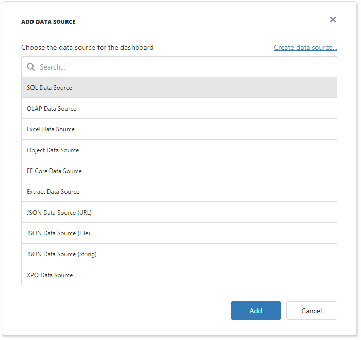

<!-- default badges list -->

<!-- default badges end -->

# Dashboard for MVC - How to Register Data Sources

The following example displays how to supply a Web Dashboard with a set of predefined data sources available for users.

The [DashboardConfigurator.SetDataSourceStorage](https://docs.devexpress.com/Dashboard/DevExpress.DashboardWeb.DashboardConfigurator.SetDataSourceStorage.overloads) method is used to register the added data sources in data source storage.

The [DashboardConfigurator.ConfigureDataConnection](https://docs.devexpress.com/Dashboard/DevExpress.DashboardWeb.DashboardConfigurator.ConfigureDataConnection) event is handled to customize connection parameters before the Web Dashboard connects to a data store (database, OLAP cube, etc.).

<!-- default file list -->
## Files to Review

* [EFDataSourceConfigurator.cs](./CS/MvcDashboardDataSources/Configuration/EFDataSourceConfigurator.cs) (VB: [EFDataSourceConfigurator.vb](./VB/MvcDashboardDataSources/Configuration/EFDataSourceConfigurator.vb))
* [ExcelDataSourceConfigurator.cs](./CS/MvcDashboardDataSources/Configuration/ExcelDataSourceConfigurator.cs) (VB: [ExcelDataSourceConfigurator.vb](./VB/MvcDashboardDataSources/Configuration/ExcelDataSourceConfigurator.vb))
* [ExtractDataSourceConfigurator.cs](./CS/MvcDashboardDataSources/Configuration/ExtractDataSourceConfigurator.cs) (VB: [ExtractDataSourceConfigurator.vb](./VB/MvcDashboardDataSources/Configuration/ExtractDataSourceConfigurator.vb))
* [JsonDataSourceConfigurator.cs](./CS/MvcDashboardDataSources/Configuration/JsonDataSourceConfigurator.cs) (VB: [JsonDataSourceConfigurator.vb](./VB/MvcDashboardDataSources/Configuration/JsonDataSourceConfigurator.vb))
* [ObjectDataSourceConfigurator.cs](./CS/MvcDashboardDataSources/Configuration/ObjectDataSourceConfigurator.cs) (VB: [ObjectDataSourceConfigurator.vb](./VB/MvcDashboardDataSources/Configuration/ObjectDataSourceConfigurator.vb))
* [OlapDataSourceConfigurator.cs](./CS/MvcDashboardDataSources/Configuration/OlapDataSourceConfigurator.cs) (VB: [OlapDataSourceConfigurator.vb](./VB/MvcDashboardDataSources/Configuration/OlapDataSourceConfigurator.vb))
* [SqlDataSourceConfigurator.cs](./CS/MvcDashboardDataSources/Configuration/SqlDataSourceConfigurator.cs) (VB: [SqlDataSourceConfigurator.vb](./VB/MvcDashboardDataSources/Configuration/SqlDataSourceConfigurator.vb))
* [XpoDataSourceConfigurator.cs](./CS/MvcDashboardDataSources/Configuration/XpoDataSourceConfigurator.cs) (VB: [XpoDataSourceConfigurator.vb](./VB/MvcDashboardDataSources/Configuration/XpoDataSourceConfigurator.vb))
* [DashboardConfig.cs](./CS/MvcDashboardDataSources/App_Start/DashboardConfig.cs) (VB: [DashboardConfig.vb](./VB/MvcDashboardDataSources/App_Start/DashboardConfig.vb))
<!-- default file list end -->

## Documentation

- [Register Default Data Sources](https://docs.devexpress.com/Dashboard/116482/web-dashboard/dashboard-backend/register-default-data-sources)

## More Examples

- [How to Register Data Sources for ASP.NET Web Forms Dashboard Control](https://github.com/DevExpress-Examples/asp-net-web-forms-dashboard-register-data-sources)
- [How to Register Data Sources for ASP.NET Core Dashboard Control](https://github.com/DevExpress-Examples/asp-net-core-dashboard-register-data-sources)
<!-- feedback -->
## Does this example address your development requirements/objectives?

 

(you will be redirected to DevExpress.com to submit your response)
<!-- feedback end -->
